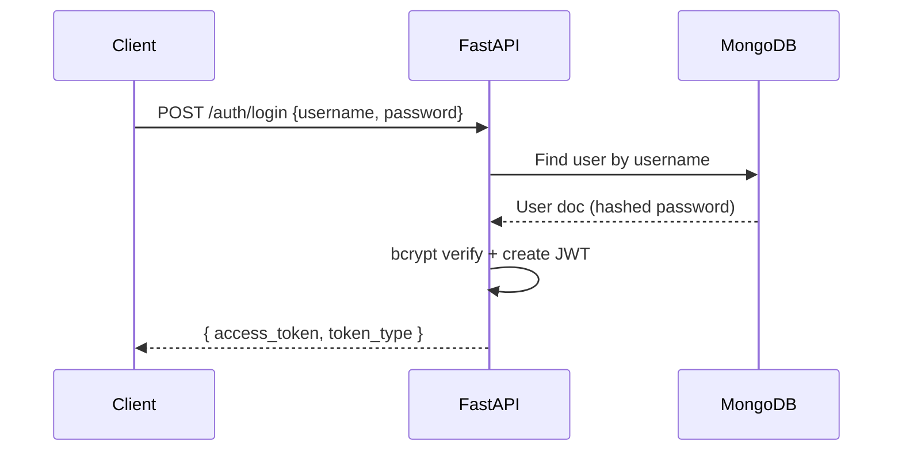

# API Reference

Base URL: http://localhost:8000

## Root
- GET /
  - Returns a welcome message and can be used as a quick liveness probe.

- GET /health
  - Returns `{ "status": "ok" }`. Used by container health checks.

## Auth (v1)
Prefix: /auth

Schemas:
- User: { user_id: string, username: string, email: Email, password: string }
- UserLogin: { username: string, password: string }
- UserUpdate: { username?: string, email?: Email, password?: string }
- Token: { access_token: string, token_type: string }

Endpoints:
- POST /auth/users/
  - Body: User
  - Response: boolean (true on success)
  - Notes: Password is bcrypt-hashed before storage.

- GET /auth/users/{user_id}
  - Response: user document (dict)

- PUT /auth/users/{user_id}
  - Body: UserUpdate
  - Response: boolean

- DELETE /auth/users/{user_id}
  - Response: boolean

- POST /auth/login/
  - Body: UserLogin
  - Response: Token
  - Notes: JWT expires in 24 hours. Include in `Authorization: Bearer <token>` for protected endpoints (future).

- POST /auth/verify-token/
  - Body: token (string)
  - Response: decoded payload if valid

## Inference (planned)
- POST /inference/classify
  - Body: { sequences: string[] }
  - Response: { predictions: Array<{ id, taxon, confidence }>, model: { name, version } }

## Jobs (planned)
- POST /jobs/train (admin only)
  - Body: { datasetId: string }
  - Triggers the training pipeline and returns a job id.

Authentication and role enforcement for planned endpoints will be detailed in SECURITY.md.

## Diagrams

Auth login flow:



Endpoint map:

```mermaid
graph TD
  A[/API v1/] --> B[/auth/]
  A --> C[/inference/ (planned)]
  A --> D[/jobs/ (planned)]

  B --> B1[users/ (CRUD)]
  B --> B2[login/]
  B --> B3[verify-token/]
  C --> C1[classify]
  D --> D1[train]
```