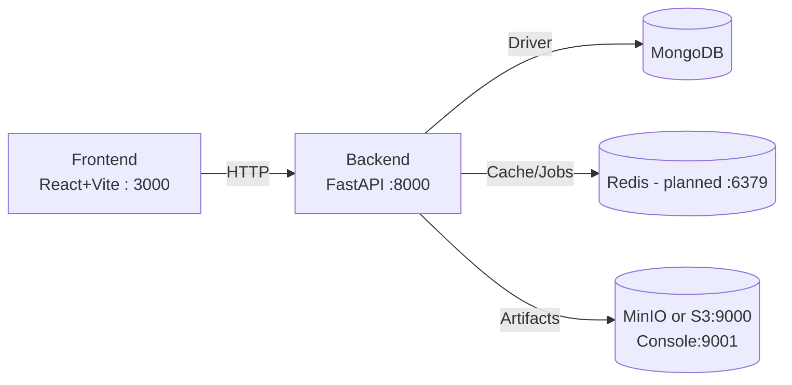

# Architecture

This project follows the FARM stack and is fully containerized for reproducible deployment.

Components:
- FastAPI backend (`backend/main.py`, `backend/src/*`)
	- Routers: `src/api/v1/*` (currently `auth_api`)
	- Services: `src/services/*` (auth, future inference and pipeline orchestration)
	- Models: `src/models/*` (Pydantic schemas)
	- Database client: `src/database/mongo_client.py`
- React + Vite + Tailwind frontend (`frontend/*`)
	- Admin and user dashboards
- MongoDB (external service)
	- Stores users, datasets, pipeline jobs, model metadata
- Redis (planned)
	- Caching of hot inference results, async queues for training jobs, rate limiting
- MinIO object storage (optional; configured in root `docker-compose.yml`)
	- Stores raw uploads, preprocessed artifacts, and model bundles
- Docker
	- Separate images/containers for frontend and backend

Networking and ports:
- Backend: 8000 (FastAPI)
- Frontend: 3000 (Vite dev/preview)
- MinIO: 9000 (S3 API), 9001 (Console)
- Redis: 6379

Configuration and environment:
- Backend expects environment variables (see `DEPLOYMENT.md`):
	- SECRET_KEY (JWT), MONGO_DB_URI, MODEL_PATH
	- Optional MINIO_* and REDIS_URL when using root compose

Data and model flow:
1) Admin uploads dataset via UI → backend stores metadata (MongoDB) and files (MinIO/local volume)
2) Training pipeline consumes the dataset, writes embeddings/clusters/models to storage
3) Deployment loads published model artifacts into the inference service
4) Users query the inference API; results can be cached (Redis planned) and logged

Security:
- JWT-based auth with bcrypt-hashed passwords; see `SECURITY.md`

See `WORKFLOW.md` for pipeline details and `DEPLOYMENT.md` for container layouts.

## Diagrams

Containers and ports at a glance:

