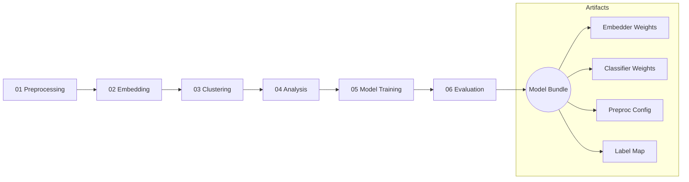

# Model Summary and Notebooks

The model R&D lives in the notebooks under `backend/notebooks/` and is organized as a linear workflow:
- 01_preprocessing.ipynb – data loading, filtering, transformations
- 02_embedding.ipynb – representation learning (e.g., DNABERT / Nucleotide Transformer)
- 03_clustering.ipynb – unsupervised discovery (UMAP/HDBSCAN, k-means, etc.)
- 04_analysis.ipynb – exploratory analyses and diagnostics
- 05_model_training.ipynb – supervised training on labels/clusters
- 06_model_evaluation.ipynb – metrics, calibration, and reporting

What we aim to build:
- Embedding model: transformer-based sequence encoder for short eDNA reads (k-mer tokenization)
- Classifier head: small MLP or linear classifier with calibration
- Optional clustering-to-label mapping for partially labeled datasets
- Evaluation: precision/recall/F1, per-taxon breakdown, and confidence calibration

Artifacts for deployment:
- Preprocessing config (k-mer size, normalization)
- Embedder weights and version tag
- Classifier weights
- Label map (taxon IDs/names) and cluster metadata

Notes:
- The exact model choice is evolving; DNABERT-style encoders are a strong baseline for DNA sequences.
- For sequences with low confidence, a hybrid fallback to reference lookups (e.g., BLAST) can be employed.
- See `WORKFLOW.md` for how these artifacts are produced and packaged.

## Diagram

Notebook-driven ML flow:

