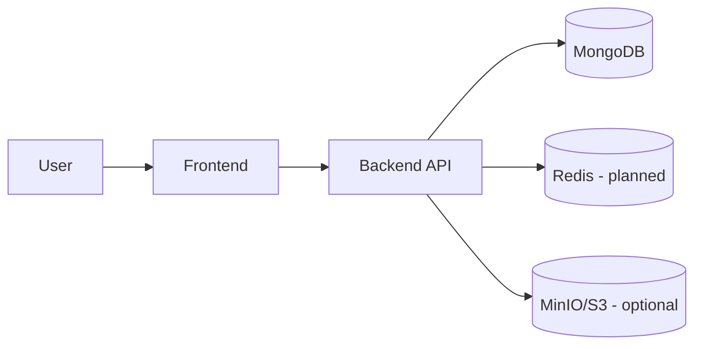

# Project Overview

This project aims to identify taxonomy and assess biodiversity from environmental DNA (eDNA) datasets collected from deep-sea environments. It minimizes dependence on incomplete reference databases by leveraging deep learning for sequence embeddings, unsupervised clustering for discovery, and supervised models for classification.

Background highlights (from details.txt):
- The deep ocean hosts vast, under-studied biodiversity. Traditional approaches depend on reference databases that poorly represent deep-sea eukaryotes.
- eDNA sequencing captures genetic traces from water/sediment to non-invasively survey communities.
- Database-only pipelines (e.g., QIIME2/DADA2/mothur) struggle with novel sequences and can be slow.
- We propose an AI-first workflow to learn from sequences directly to improve discovery and reduce reliance on databases.

High-level solution:
- Two pipelines
	- Training pipeline: loads eDNA reads, preprocesses, computes embeddings, clusters, trains classifiers, evaluates, and packages models.
	- Deployment pipeline: loads packaged models and supporting artifacts, serves inference APIs, and integrates with the dashboard.
- FARM stack
	- FastAPI: backend APIs for auth, datasets, and inference
	- React + Vite + Tailwind: dashboard and user interface
	- MongoDB: metadata store for users, datasets, jobs, and results
	- Redis: cache and async jobs (planned)
- Containerized deployment with Docker for isolated frontend, backend, and infra services (MinIO, Redis).

User roles:
- Admin: logs in, uploads new datasets, triggers training. Monitors pipeline runs and publishes models.
- General user: browses trained data, runs eDNA classification on new samples/sequences via the UI.

Current status:
- Auth API and MongoDB integration are in place.
- ML pipelines are under construction; notebooks document the current R&D path (01 to 06).
- Redis caching/queues are planned. Health endpoint added for container checks.

See Architecture for system components and Pipelines for step-by-step workflows.

## Diagram

High-level view:

