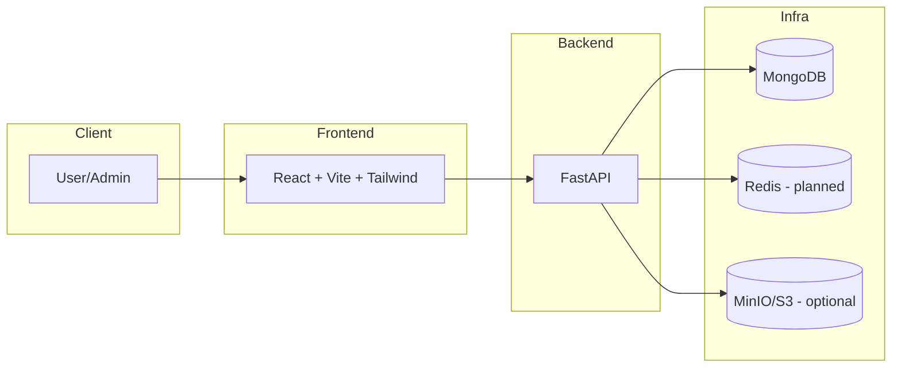
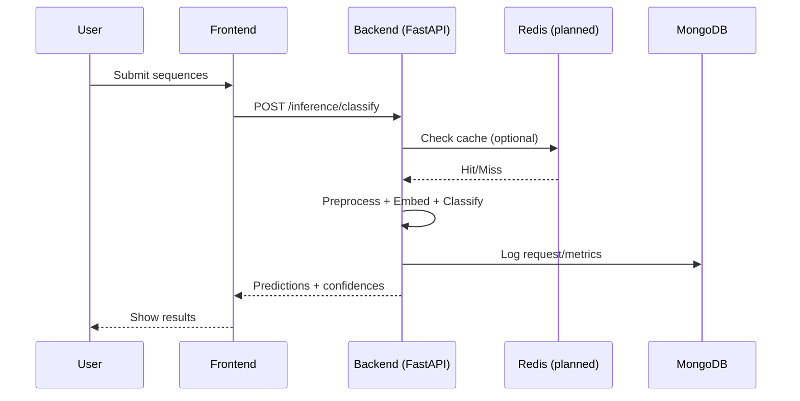
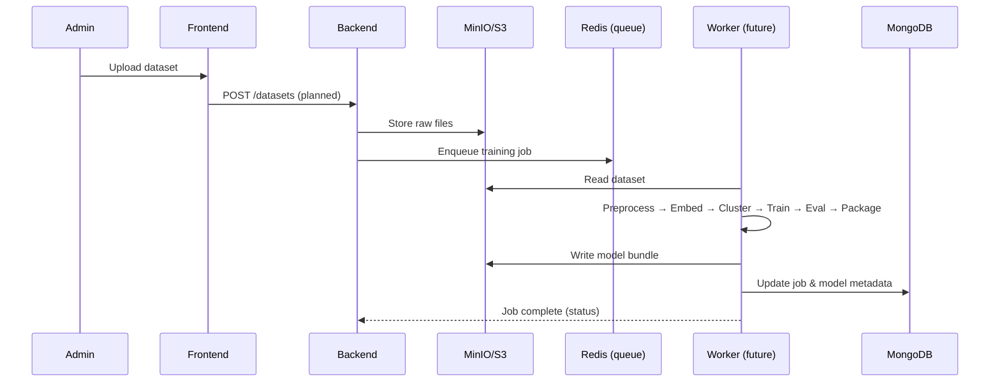

# eDNA Species Classifier – Documentation Hub

Welcome to the documentation for the eDNA Species Classifier project. This backend powers AI-driven analysis of environmental DNA to identify taxa and assess biodiversity, while the frontend provides an interactive dashboard for admins and users.

- Tech stack (FARM): FastAPI (Backend), React + Vite + Tailwind (Frontend), MongoDB (Database), Redis (Caching/Jobs – planned)
- Containerization: Docker with separate frontend and backend services; optional MinIO object storage; Redis planned
- Pipelines: Training and Deployment pipelines orchestrate data ingestion to inference

Quick links:
- Overview: ./OVERVIEW.md
- Architecture: ./ARCH.md
- Pipelines and Workflow: ./WORKFLOW.md
- Model Summary: ./ML_MODEL.md
- API Reference: ./API.md
- Security and Auth: ./SECURITY.md
- Deployment Guide: ./DEPLOYMENT.md
- References: ./REFERENCE.md

Repository structure (relevant parts):
- backend/main.py – FastAPI app
- backend/src/ – API routes, services, models, and database client
- backend/pipelines/ – ML pipeline entry points (under construction)
- backend/notebooks/ – Data science notebooks (preprocessing → evaluation)
- frontend/ – React + Tailwind UI

If you’re new, read Overview and Architecture first, then Pipelines, then API/Deployment.

## Diagrams

Brief visuals to make the setup transparent to contributors.

Architecture (containers and data flow):

Sequence – inference (planned endpoints):

Sequence – admin training trigger (planned):

