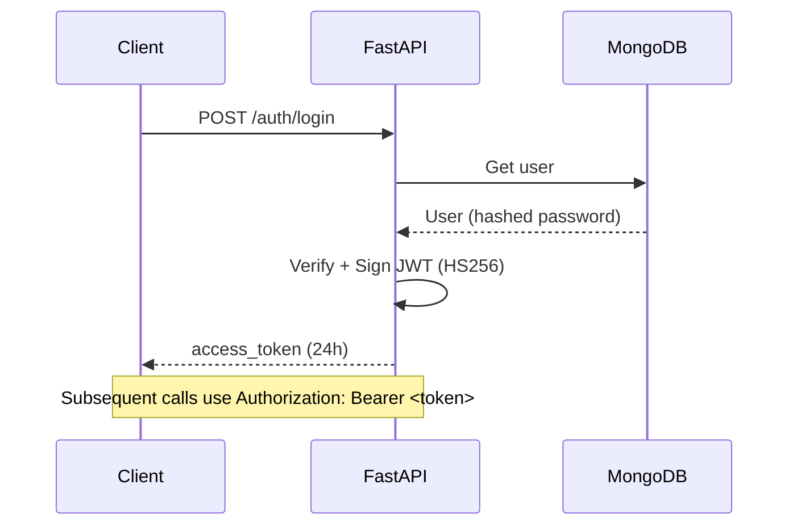

# Security and Authentication

This backend uses JWT-based authentication and bcrypt-hashed passwords.

## Credentials and storage
- Passwords are hashed using bcrypt before being stored in MongoDB (`src/services/auth_service.py`).
- MongoDB connection string is provided via `MONGO_DB_URI`.

## Tokens
- Access tokens are JWTs signed with HS256 (`SECRET_KEY`).
- Default expiry: 24 hours.
- Include tokens in requests via `Authorization: Bearer <token>`.

## Roles
- Admin
  - Can upload datasets and trigger training jobs
  - Can manage users
- User
  - Can browse dashboards and run inference

Role enforcement is being wired into endpoints; current `auth` routes provide user management and login. Future endpoints will require a valid bearer token and role checks.

## Planned hardening
- Redis for blacklisting/refresh tokens and rate limiting
- Stronger password policies and email verification
- HTTPS, secure cookie support for web flows
- Audit logs for model publish and dataset access

## Diagram

Authentication flow (JWT):

