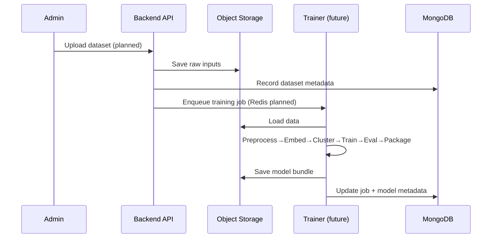
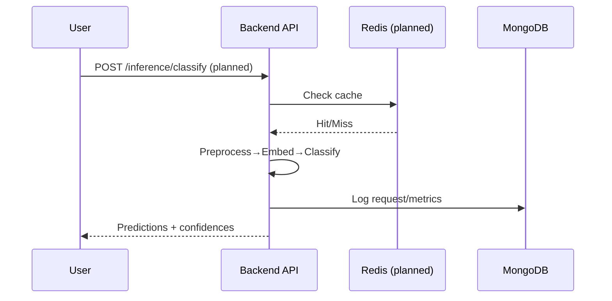

# Pipelines and Workflow

This project contains two pipelines:
- Training pipeline
- Deployment (inference) pipeline

Both are under active development. This document describes the intended end-to-end flow so contributors can align code and UI integration.

## 1) Training pipeline

Goal: produce a deployable model bundle from raw eDNA reads with minimal reliance on external reference databases.

Steps (intended):
1. Load data
	- Ingest raw reads and metadata from uploads (UI) or archives (`backend/data/archives/`)
	- Register dataset metadata in MongoDB; store files in MinIO/local volume
2. Preprocessing
	- Clean, filter, deduplicate reads; trim adapters, length checks
	- Optional: dereplication/denoising if needed for read quality
3. Embedding extraction (and save embedders)
	- Compute sequence embeddings using a transformer model (e.g., DNABERT / Nucleotide Transformer)
	- Persist the embedding model/version and config for reproducibility
4. Clustering (unsupervised discovery)
	- Cluster embeddings to discover putative taxa groups (e.g., UMAP + HDBSCAN / k-means)
	- Generate cluster labels, exemplars, and cluster-level summaries
5. Training (supervised)
	- Train classifiers/regressors on labeled/clustered data (or semi-supervised)
	- Calibrate thresholds; track metrics
6. Evaluation
	- Evaluate on held-out sets; compute precision/recall/F1, clustering quality (e.g., silhouette), calibration
	- Generate reports and figures
7. Packaging
	- Export model bundle: embedder weights/version, classifier weights, preprocessing params, label map, cluster info
	- Store in model registry path (volume or MinIO)

Artifacts:
- Embedding model and config
- Cluster assignments and exemplars
- Trained classifier(s) and label maps
- Evaluation reports and metrics
- Deployment-ready model bundle directory

Triggering:
- Admin uploads a dataset via UI → backend enqueues a training job (Redis/worker planned) → pipeline runs and publishes the bundle

## 2) Deployment pipeline (inference)

Goal: load a model bundle and serve classification as an API for the frontend.

Steps (intended):
1. Load model
	- Read MODEL_PATH from env; fetch bundle from volume/MinIO
2. Initialize runtime
	- Load preprocessing config, tokenizer/k-mer settings
	- Load embedding model and classifier into memory (GPU/CPU auto-select)
3. Warm-up and cache (planned)
	- Warm up with example reads; prepare Redis cache for frequent queries
4. Request handling
	- Validate input sequences; batch and pad if needed
	- Preprocess and embed sequences
	- Run classifier to predict taxa/labels and confidences
5. Post-processing
	- Map predictions to taxonomy; attach provenance (model version, thresholds)
	- Optionally route low-confidence reads for fallback (e.g., BLAST reference lookup)
6. Response and logging
	- Return structured JSON with predictions, confidences, and metadata
	- Persist usage logs and optional telemetry; cache recent results (Redis planned)

Endpoints (planned):
- POST /inference/classify – classify one or more sequences
- GET /models/current – model/version metadata
- POST /jobs/train – trigger training (admin only)

See notebooks `01_preprocessing.ipynb` through `06_model_evaluation.ipynb` for the current prototype implementations and experiments.

## Diagrams

Training pipeline (sequence):

Inference pipeline (sequence):

